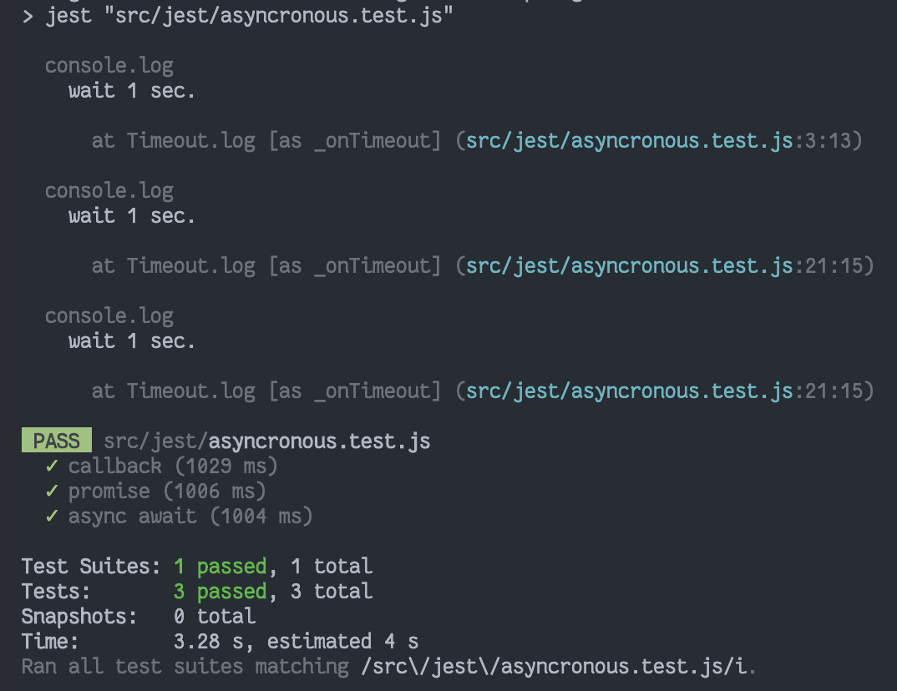

## How to Use Callback

```js
const jestCallback = (id, cb) => {
  setTimeout(() => {
    console.log("wait 0.1 sec.")
    const user = {
      id,
    }
    cb(user)
  }, 100)
}
// 에러가 발생하는 코드
it("callback", () => {
  jestCallback(1, (user) => {
    expect(user).toEqual({ id: 1 })
  })
})

// done을 인자로 넘겨주어야 한다!
it("callback", (done) => {
  jestCallback(1, (user) => {
    expect(user).toEqual({ id: 1 })
    done() // callback 호출 확인하기 위한 jest 함수 인자로 받아 실행
  })
})
```

## How to Use Promise

```js
test("fetch a user", () => {
  //return 을 추가 -> Promise return -> wait resolve()
  return fetchUser(2).then((user) => {
    expect(user).toEqual({
      id: 1,
      name: "User1",
      email: "1@test.com",
    })
  })
})
```

## How to Use Async/Await

```js
test("fetch a user", async () => {
  const user = await fetchUser(1)
  expect(user).toEqual({
    id: 1,
    name: "User1",
    email: "1@test.com",
  })
})
```

ASYNCHRONOUS

