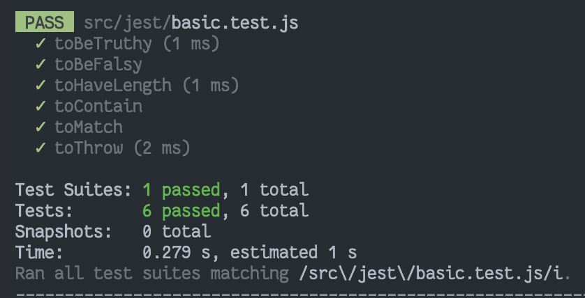

# Jest

`Meta` 에서 만든 자바스크립트 테스팅 프레임워크

## Install

```bash
pnpm install -D jest
```

## Script

```json
// package.json
"scripts": {
	"test": "jest"
}
```

## Example

```jsx
test("segment to clock", () => {
  // 03:55
  const input1 = [
    [1, 1, 1, 1, 1, 1, 0],
    [1, 1, 1, 1, 0, 0, 1],
    [1, 0, 1, 1, 0, 1, 1],
    [1, 0, 1, 1, 0, 1, 1],
  ]

  expect(solution(input1)).toEqual([0, 3, 5, 5])
})
```

## Command

`pnpm test <파일명>`

## Useful Matcher

| 함수                        | 기능                                                                              |
| --------------------------- | --------------------------------------------------------------------------------- |
| `toEqual()`                 | 테슽의 값이 `toEqual()` 의 인자와 같은지 확인                                     |
| `toBeTruthy(), toBeFalsy()` | `true`, `false`, `0`, `1` 등 **truthy**, **falsy** 인지 확인 - 인자를 넘기지 않음 |
| `toHaveLength()`            | 인자의 값과 테스트한 값(배열)의 길이가 동일한지 확인                              |
| `toContain()`               | 인자의 값이 배열에 존재하는지 확인                                                |
| `toMatch()`                 | 정규식으로 확인                                                                   |
| `toThrow()`                 | 예외 발생 여부 테스트 `expect()` 에 검증할 함수를 함수로 한번 더 감싸주어야 함    |


